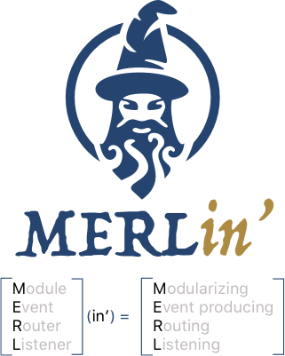

   

MERLin' is a reactive framework that aims to simplify the adoption of an events based architectural style within an iOS app. It emphasise the concept of modularity, taking to the highest level the principle of separation of concerns.

MERLin' uses RxSwift to power the chosen messaging design pattern which is Publish-subscribe.

With high modularity comes high testability, control over dependencies and a lower build time.

For more please read our [wiki](https://github.com/gringoireDM/MERLin/wiki).

Wanna talk with us and ask for more information? Join our [slack channel](https://join.slack.com/t/merlin-framework/shared_invite/enQtNjYyMzQ3NDc1NDg5LTcxOTgyYjZhYzk0OTI4YjFjOGZlM2FlMjYxMzFkNzA2ZTI4Y2I4ZGRiYmE0ZjdmMTdjODkyYWFmMDdmOGU3ZjA)
